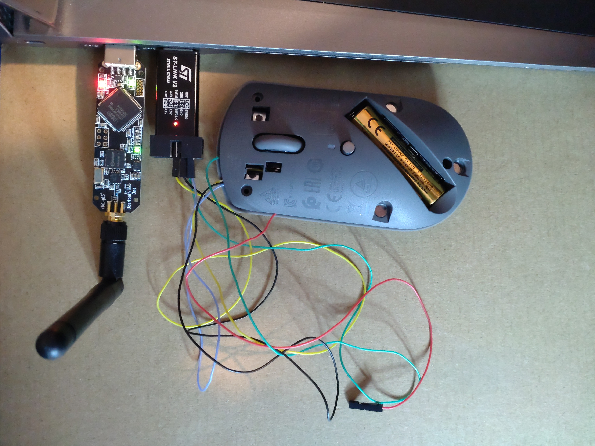
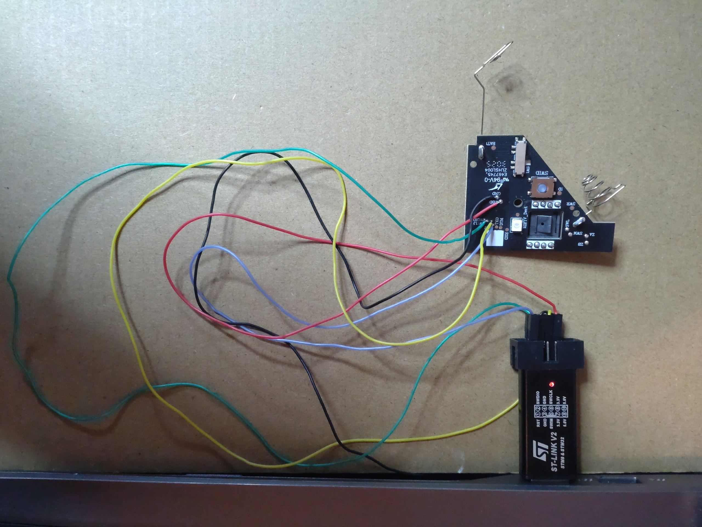
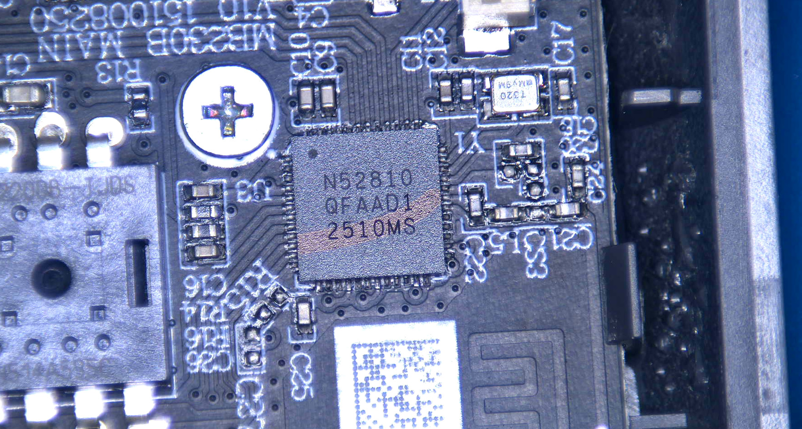

# Lenovo-600-BT-Mouse_patch

This patch fixes the 2 second lag in the Firmware that apears (at least) in Windows 11 if the mouse is untouched for about 15 seconds.

Because of a lack of programming knowledge, i let claude code do the whole work. After the "new" Lenovo 600 mouse arrived, i was disapointed about the lagging behavior. I disassembled the mouse and found two pretty well made boards inside. One of them has SWD markings on some contact points. I soldered some flying wires on it and hooked up a ST-Link V2 clone to it. I had good experiences with claude code and gave it a try on this project. I let claude code grab the firmware using openocd. Claude took less than 10 seconds for this job because there was no readout protection on the chip.

I adviced claude to find the lagging function and fix it. Thats it. It took me some hours (and $), a lot of pressing "1" or "2" key. But finally claude code fixed the problem. I let claude use ghidra/MCP for disassembly the firmware.

## View

 

 
